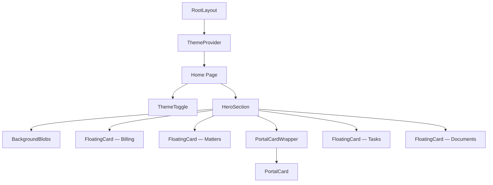

<div align="center">

# ✨ Floating Hero — Legal Work Platform

A stunning, animated hero section for a **Legal Work Management Platform** — built with **Next.js 16**, **Framer Motion**, and **Tailwind CSS 4**.

[](https://nextjs.org/)
[](https://react.dev/)
[](https://tailwindcss.com/)
[](https://www.framer.com/motion/)
[](https://www.typescriptlang.org/)
[](LICENSE)

</div>

Live Demo - [Link](https://round-1-assignments-sahil.vercel.app/)

---

## 📋 Table of Contents

- [Overview](#-overview)
- [Key Features](#-key-features)
- [Tech Stack](#-tech-stack)
- [Project Structure](#-project-structure)
- [Getting Started](#-getting-started)
- [Component Architecture](#-component-architecture)
- [Theming](#-theming)
- [Design Tokens](#-design-tokens)
- [Animations](#-animations)
- [Deployment](#-deployment)

---

## 🔍 Overview

**Floating Hero** is a pixel-perfect, production-ready hero section designed for a legal work management SaaS product. It features floating pill-shaped cards that represent core platform modules — **Billing**, **Matters**, **Tasks**, **Documents**, and a live **Portal notification** — all animated with Framer Motion and floating gently on screen.

> _"A single platform to **manage** every part of your **legal work**"_

The component is fully responsive, supports **light & dark themes**, and is built with accessibility in mind.

---

## ⚡ Key Features

| Feature | Description |
|---|---|
| 🎴 **Floating Cards** | Pill-shaped, color-coded cards (blue, orange, dark) that float with parallax-style animations |
| 🌗 **Dark / Light Mode** | Seamless theme toggle with `localStorage` persistence & system preference detection |
| 🎨 **Animated Blobs** | Soft gradient background blobs and diagonal stripes that animate on load |
| 💬 **Portal Card** | A realistic notification card with avatar, message preview, and case ID |
| 🖱️ **Hover Interactions** | Cards scale up and un-rotate on hover for a tactile, interactive feel |
| 📱 **Fully Responsive** | Adapts gracefully from mobile (`375px`) to ultra-wide (`1400px+`) |
| ⚡ **Optimized Fonts** | Plus Jakarta Sans loaded via `next/font` for zero layout shift |
| ♿ **Accessible** | Proper `aria-labels`, semantic HTML, and keyboard-navigable toggle |

---

## 🛠️ Tech Stack

| Technology | Version | Purpose |
|---|---|---|
| **Next.js** | `16.2.6` | App Router, SSR, font optimization |
| **React** | `19.2.4` | UI rendering with latest concurrent features |
| **TypeScript** | `5.x` | Type safety across all components |
| **Tailwind CSS** | `4.x` | Utility-first styling with CSS-variable theming |
| **Framer Motion** | `12.40.0` | Spring-based animations & gesture handlers |
| **Lucide React** | `1.16.0` | Lightweight, customizable SVG icons |

---

## 📁 Project Structure

```
floating-hero/
├── app/
│   ├── components/
│   │   ├── BackgroundBlobs.tsx   # Animated gradient blobs + diagonal stripes
│   │   ├── FloatingCard.tsx      # Reusable pill card (blue/orange/dark variants)
│   │   ├── HeroSection.tsx       # Main hero composition — text + cards layout
│   │   ├── PortalCard.tsx        # Notification-style card with avatar
│   │   ├── ThemeProvider.tsx     # React Context for light/dark theme state
│   │   └── ThemeToggle.tsx       # Sun/Moon toggle button (fixed position)
│   ├── globals.css               # Design tokens, keyframes, Tailwind config
│   ├── layout.tsx                # Root layout — font loading, metadata, ThemeProvider
│   ├── page.tsx                  # Home page — renders HeroSection + ThemeToggle
│   └── favicon.ico
├── public/
│   └── avatar.png                # Avatar image for the Portal card
├── package.json
├── tsconfig.json
├── next.config.ts
├── postcss.config.mjs
└── eslint.config.mjs
```

---

## 🚀 Getting Started

### Prerequisites

- **Node.js** `18.x` or later
- **npm**, **yarn**, **pnpm**, or **bun**

### Installation

```bash
# 1. Clone the repository
git clone https://github.com/your-username/floating-hero.git
cd floating-hero

# 2. Install dependencies
npm install

# 3. Start the development server
npm run dev
```

Open **[http://localhost:3000](http://localhost:3000)** in your browser.

### Available Scripts

| Command | Description |
|---|---|
| `npm run dev` | Start dev server with hot reload |
| `npm run build` | Create optimized production build |
| `npm run start` | Serve the production build |
| `npm run lint` | Run ESLint checks |

---

## 🧩 Component Architecture



### Component Breakdown

#### `FloatingCard`
The core reusable component. Accepts props for:
- **`color`** — `"blue"` | `"orange"` | `"dark"` — each maps to a curated color palette
- **`rotation`** — tilt angle in degrees
- **`icon`** — any Lucide icon component
- **`label`** — display text
- **`floatAnimation`** — `"slow"` (8s) | `"medium"` (6s) | `"fast"` (5s)
- **`size`** — `"default"` | `"large"` for bigger padding

#### `PortalCard`
A notification-style card displaying:
- User avatar (Next.js `<Image>` optimized)
- Name, message preview, case ID, and timestamp
- Wrapped in `PortalCardWrapper` for positioning and animation

#### `BackgroundBlobs`
Creates the ambient background with:
- 3 large, soft gradient blobs with scale-in animation
- 6 diagonal stripes (3 upper-right, 3 lower-left) at `-15deg`

#### `ThemeProvider` & `ThemeToggle`
- Context-based theme management
- Persists choice to `localStorage`
- Falls back to `prefers-color-scheme` media query
- Animated Sun ↔ Moon icon with rotation transition

---

## 🌗 Theming

The app uses **CSS custom properties** for theming, toggled via a `.dark` class on `<html>`:

| Token | Light | Dark |
|---|---|---|
| `--background` | `#f5f5fa` | `#0f0d1a` |
| `--foreground` | `#1a1a2e` | `#e8e6f0` |
| `--accent-blue` | `#4f46e5` | `#6366f1` |
| `--accent-orange` | `#f59e0b` | `#fbbf24` |
| `--accent-dark` | `#1e1b3a` | `#2d2a4a` |
| `--accent-purple` | `#6c5ce7` | `#8b7cf7` |
| `--card-bg` | `#ffffff` | `#1a1730` |
| `--blob-color` | `rgba(199,210,254,0.5)` | `rgba(99,102,241,0.15)` |

These are mapped to Tailwind via `@theme inline` in `globals.css`.

---

## 🎞️ Animations

All animations are defined as CSS `@keyframes` and registered in Tailwind's theme:

| Animation | Duration | Behavior |
|---|---|---|
| `float-slow` | 8s | Gentle `translateY(0 → -12px)` bob |
| `float-medium` | 6s | Moderate `translateY(0 → -18px)` bob |
| `float-fast` | 5s | Quick `translateY(0 → -10px)` bob |
| `blob` | 7s | Scale + translate morph for background blobs |

**Framer Motion** handles:
- Staggered entry animations with configurable `delay`
- `whileHover` scale + rotation reset
- Smooth spring-based easing: `[0.25, 0.46, 0.45, 0.94]`

---

## 🌐 Deployment

### Vercel (Recommended)

The easiest way to deploy is via **[Vercel](https://vercel.com/new)**:

1. Push your code to GitHub / GitLab / Bitbucket
2. Import the repo on [vercel.com/new](https://vercel.com/new)
3. Vercel auto-detects Next.js — click **Deploy**

### Other Platforms

```bash
# Build for production
npm run build

# Start the production server
npm run start
```

The `next build` output can be deployed to any Node.js hosting platform (AWS, Railway, Render, etc.)

---

<div align="center">

**Built with ❤️ using Next.js, Framer Motion & Tailwind CSS**

</div>
